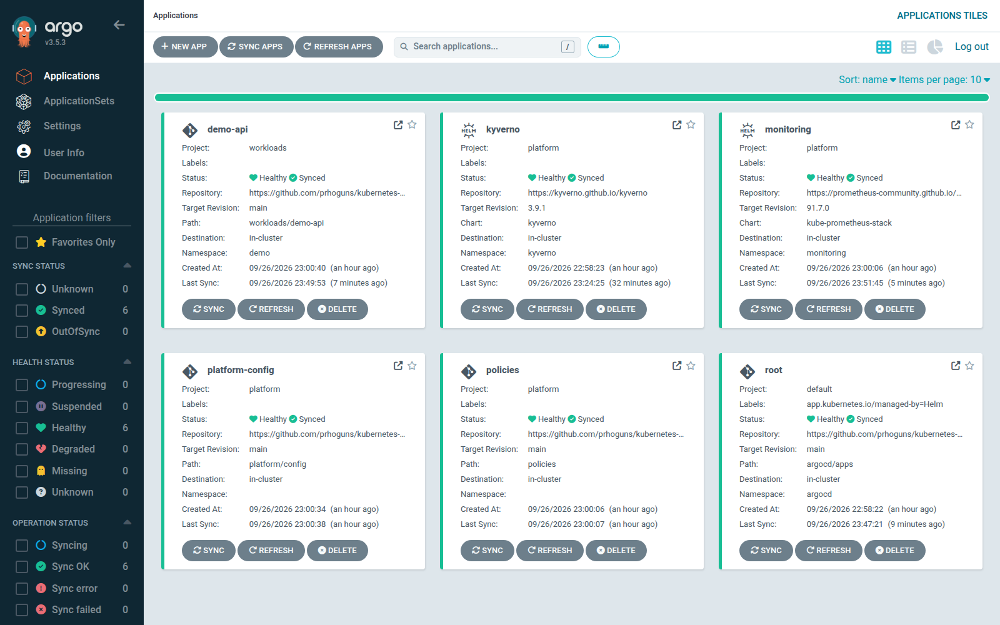
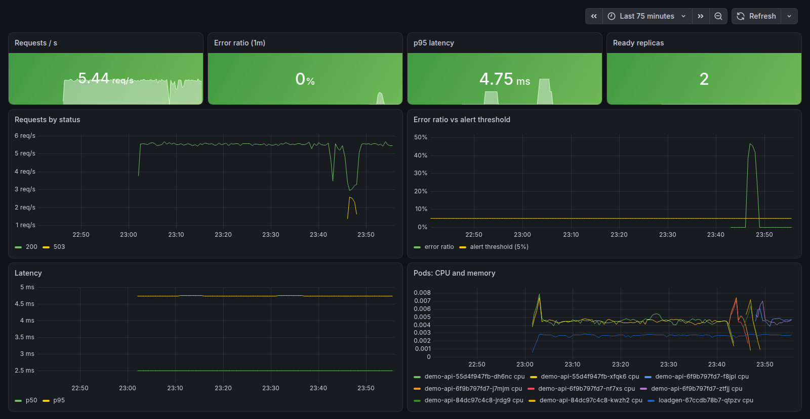

# Kubernetes GitOps Platform

_Status: Built and verified September 26–27, 2026. Every result below came from a real run; CI rebuilds the whole platform from scratch on every push._

A Kubernetes platform that is run entirely from this repository. Terraform installs one thing,
Argo CD. Argo CD then installs everything else from Git: a policy engine that only admits images
signed by my build pipeline, Prometheus and Grafana with alerting, namespaces with quotas and
read-only RBAC, and the application itself. Nobody runs `kubectl apply`; a change is a commit.

It is the deployment half of a two-repo setup. The build half,
[devsecops-supply-chain](https://github.com/prhoguns/devsecops-supply-chain), scans, signs and
publishes the image, then commits its digest here. This repo decides whether that image may run.



## What it proves

| Claim | How it is checked |
|---|---|
| The cluster can be rebuilt from Git alone | CI creates a fresh 3-node cluster and bootstraps it from the commit under test |
| Only images signed by the pipeline on `main` can run | Kyverno `ImageValidatingPolicy`: rejects an unsigned image and one signed by a *different* workflow, both real images in the same registry |
| Images are pinned by digest from one registry | `ValidatingPolicy` rejects `nginx:1.29` and `ghcr.io/prhoguns/demo-api:main` |
| Containers run non-root, read-only, with no capabilities | `ValidatingPolicy` plus Pod Security `restricted`; bad Deployments are rejected at apply time, not later as failing pods |
| The app is isolated on the network | Default-deny NetworkPolicy: another namespace cannot reach it, it cannot reach the internet, the load generator can |
| Developers can look but not change | `kubectl auth can-i` checks: can read pods and logs, cannot read secrets, exec, or edit deployments |
| Alerting works end to end | 50% injected errors → `DemoApiHighErrorRate` fires in Prometheus and reaches Alertmanager |
| Drift is corrected | A manual `kubectl set env` is reverted to the Git value; a deleted Service is recreated |

**Results:** 32/32 end-to-end checks, 22/22 offline policy tests, 13/13 Terraform tests (EKS and
AKS modules, mocked providers), kubeconform 27/27 manifests valid. Checkov: 130 Terraform and 189
Kubernetes checks passed, 0 failed; the 14 skipped checks each carry a written reason next to the
code they apply to.

## How it fits together

```
 devsecops-supply-chain (build)                       this repo (deploy)
 ─────────────────────────────                        ──────────────────
 test → Gitleaks → Semgrep → Trivy → Checkov          workloads/demo-api/kustomization.yaml
   → build → Trivy image scan                           digest: sha256:…   ◄── bot commit
   → push to GHCR → cosign sign (keyless)                       │
   → SBOM attestation → SLSA provenance                         ▼
   → commit new digest here ───────────────────────►  Argo CD (app of apps, sync waves)
                                                        wave 0  Kyverno
                                                        wave 1  policies, kube-prometheus-stack
                                                        wave 2  namespaces, quotas, RBAC, dashboards
                                                        wave 3  demo-api
                                                                │
                                                                ▼
                                                      Kyverno admission: signature from
                                                      pipeline.yml@refs/heads/main? SBOM
                                                      attestation? digest? non-root? limits?
```

Two Argo CD projects keep the blast radius small. `platform` may install cluster-wide objects.
`workloads` may only deploy into the `demo` namespace from this repo, and cannot create
cluster-scoped objects, RBAC, quotas or limit ranges, so a team cannot raise its own limits.

## Run it

Needs Docker, [kind](https://kind.sigs.k8s.io), kubectl, Terraform and Python 3. About 3 GB of RAM
for the cluster.

```bash
make up     # kind cluster + Terraform bootstrap; Argo CD installs the rest (~5 minutes)
make test   # the end-to-end suite (~8 minutes, most of it waiting for the alert to fire)
make ui     # Argo CD on :8080 and Grafana on :3000, prints both admin passwords
make down   # delete the cluster
```

`REVISION=<branch or commit> make up` deploys something other than `main`; CI uses it to test a
commit before it merges.

To watch GitOps and alerting together: change `ERROR_RATE` in
`workloads/demo-api/deployment.yaml` to `"0.2"`, push, and watch Argo CD roll it out and the
alert fire in Grafana a couple of minutes later. Set it back to `"0"` to resolve it.



## Layout

```
infra/bootstrap/       Terraform: Argo CD, the root Application, the Grafana admin secret
infra/modules/eks/     Terraform module: VPC, EKS, managed nodes, KMS, access entries (+ tests)
infra/modules/aks/     Terraform module: VNet, AKS, Entra ID RBAC, Defender, Log Analytics (+ tests)
argocd/apps/           Helm chart rendering the AppProjects and one Application per component
policies/              Kyverno policies, and tests/ with offline unit tests for them
platform/              Kyverno and monitoring values; namespaces, quotas, RBAC, dashboard
workloads/demo-api/    Deployment, Service, NetworkPolicies, PDB, ServiceMonitor, alerts
tests/e2e.sh           End-to-end suite run locally and in CI
```

## Decisions and why

- **Terraform only bootstraps.** Terraform owns the parts that must exist before Argo CD can
  work (Argo CD itself, and the Grafana secret, which must not live in Git). Everything else is
  reconciled by Argo CD, so drift is corrected continuously instead of on the next `apply`.
- **Deploy by digest, verify the signer, not just the signature.** A tag can be moved to other
  content. The policy pins the exact signing identity
  (`…/devsecops-supply-chain/.github/workflows/pipeline.yml@refs/heads/main`), so an image signed
  from a branch, a fork or another repo is rejected even though its signature is valid. The
  `wrong-identity` test image exists to prove this.
- **Kyverno's CEL policy types.** `ClusterPolicy` is deprecated in Kyverno 1.19; the policies use
  `ValidatingPolicy` and `ImageValidatingPolicy` instead, with autogen so Deployments are rejected
  at apply time.
- **Policies are on by default.** They exclude a fixed list of platform namespaces instead of
  requiring workloads to opt in, so a new namespace is covered the moment it exists.
- **Memory limits, no CPU limits.** Requests reserve CPU for each pod. CPU limits would only
  throttle it without protecting anyone else. Memory has to be capped because memory can't be
  reclaimed by throttling.
- **Humans get read-only access.** Changes go through Git, so write access is unnecessary, and
  every change has an author and a review trail.
- **The load generator runs from the same signed image** (`python -m app.loadgen`), so there is
  no exception in the policies for "just a test tool".

## Problems I hit

Each of these was found by the tests or by Argo CD, and each has a commit.

- **Rolling updates stuck at Pending.** The topology spread rule counted the tainted
  control-plane node as a zone with zero pods, so any third pod looked unbalanced. Fixed with
  `nodeTaintsPolicy: Honor`, and `matchLabelKeys: [pod-template-hash]` so each rollout revision is
  spread on its own.
- **An alert that could never fire.** `errors / total` returns *nothing*, not 0, while no 5xx
  series exists yet. Fixed with `or vector(0)` in the recording rule.
- **Kyverno permanently OutOfSync.** The chart renders `labels: {}` and `annotations: {}` on its
  new CRDs; the API server drops empty maps, so Argo CD always saw a diff. Fixed by giving them
  real values instead of ignoring the whole field.
- **The root app fighting Argo CD.** Argo CD adds pre-delete finalizers to apps whose charts
  have pre-delete hooks. The root app now ignores exactly those finalizers and nothing else.
- **Nobody could log in to Grafana.** The chart generates a random password on every render,
  and Argo CD renders constantly, so the stored secret drifted from the real password. The
  password is now generated once by Terraform and referenced by name.
- **CI failed on someone else's rate limit.** One run timed out installing Argo CD because the
  public AWS registry answered `429 Too Many Requests` for the Redis image (CI runners share IP
  addresses). CI now pulls the chart's images on the runner with retries and imports them into the
  nodes before bootstrapping. `kind load` itself failed on multi-platform images, so the script
  imports into containerd directly.
- **The test summary under-counted.** Checks on the right of a pipe ran in subshells, so their
  results were lost from the counters. Results now go to a file.

## Not done yet

- The EKS and AKS modules are validated and tested against mocked providers but have not been
  applied to a real account. The local platform runs on kind.
- Single replicas for Argo CD and Kyverno, and no ingress or TLS; production would run three
  Kyverno admission replicas because the policies fail closed.
- Alertmanager routes to a null receiver. Next step: a Slack or email route.
